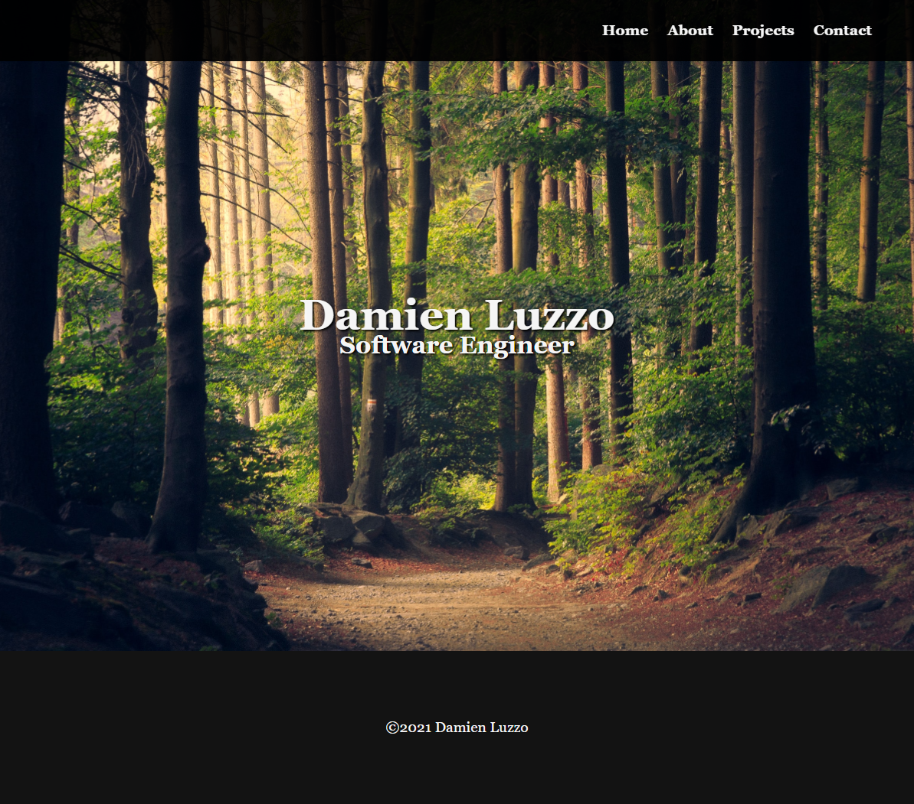
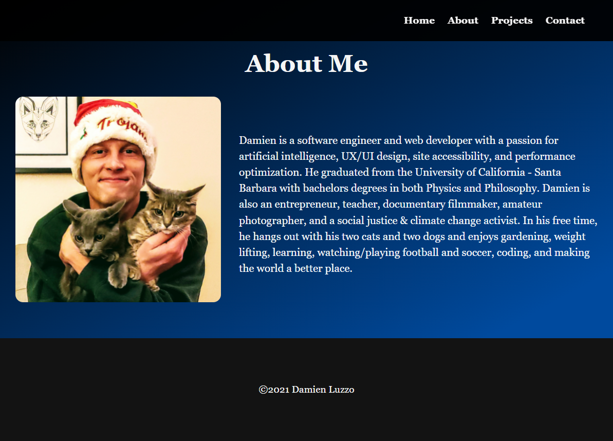
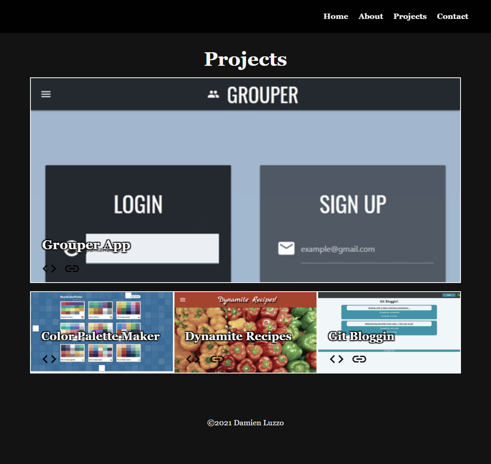
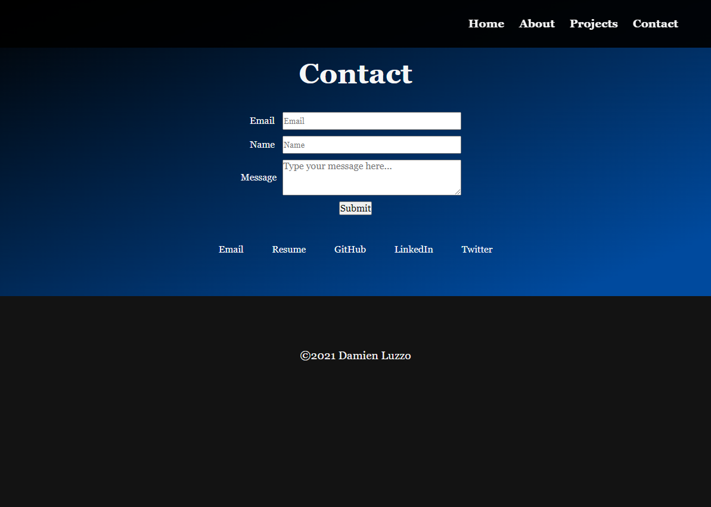

# Damien Luzzo Portfolio Website

Who is Damien Luzzo? Click the link below to find out.

[Damien Luzzo's Awesome Portfolio On Netlify](https://61b05087eb75790007426955--trusting-visvesvaraya-554a02.netlify.app/)

## Current Features

+ Banner image with name and title

+ Personal photo and about me section

+ Includes section for my top portfolio projects and past work

+ Contains my contact information

+ Github, resume, twitter, email, and linkedIn pages are all linked in contact section

+ Area for others to compose messages

+ Conditionally renders with react-router-dom

+ Webpage is fully responsive

---

## Future Features

+ Add a blog section

+ Add an introduction to my work history and education and skills for employers

+ Add a fun interactive page

---

## Screenshots

## Libraries

+ React
+ React-Router-Dom
+ Google Fonts
+ Upsplash Photos
+ Material UI Icons
